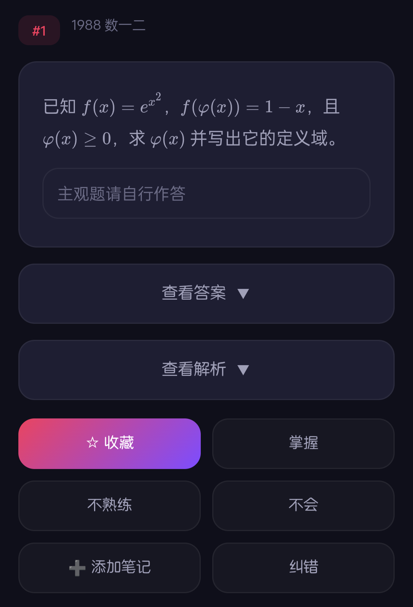

# cxy-web-app

QQ群：991054688

欢迎大家提交Pr与Issue。

## 功能介绍

### 本地收藏 · 离线可看
APP 登录后自动同步网页端收藏的题目，并缓存至本地设备。即使遇到网站维护或没有网络，也能随时打开收藏本，查看已保存的题目内容，复习不中断。

## 使用技术
### Flutter
遵循完整的MVVM开发模式，具体开发文档请参见docs目录
### Java（will be soon deprecated）
后续Java版本将被废弃，现有Java版本仅为测试目的，请勿修改此分支
